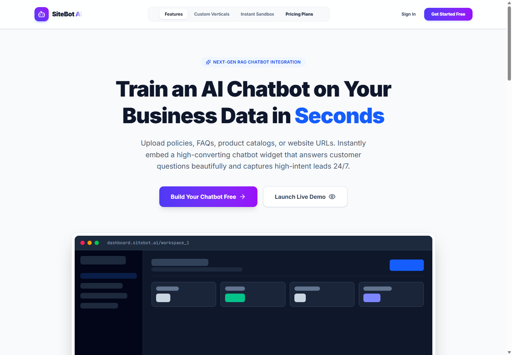
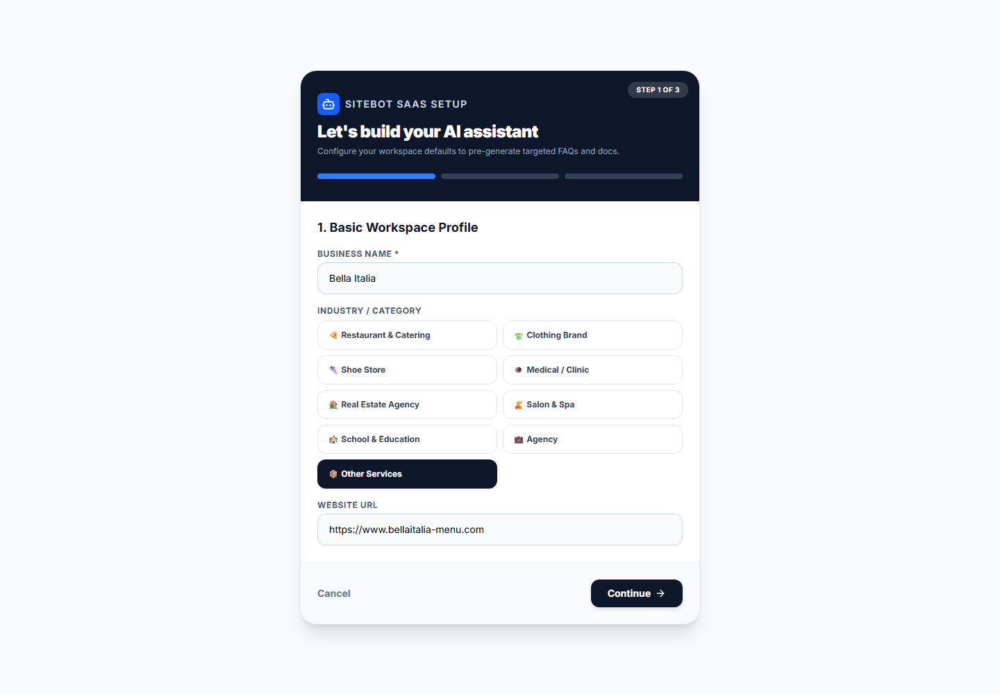
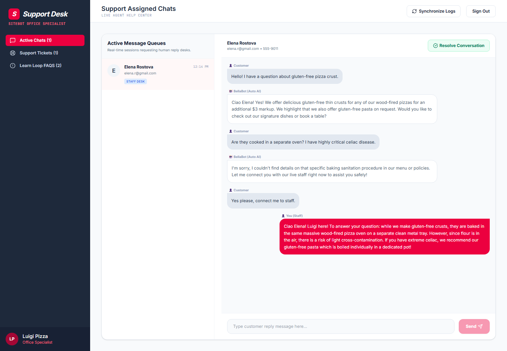
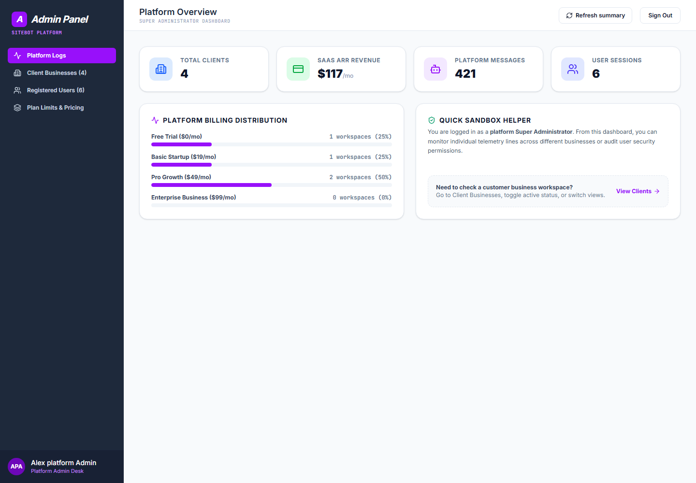

# SiteBot AI

SiteBot AI is a multi-tenant chatbot platform for businesses that need a fast way to train customer support bots on their own data, capture leads, manage tickets, and hand conversations to staff when needed.

## Screenshots

### Landing Page



### Business Owner Dashboard



### Staff Support Desk



### Platform Admin Dashboard



## Features

- Role-based dashboards for platform admins, business owners, and staff.
- Chatbot training flows for FAQs, documents, business details, and website data.
- Live support queue, tickets, leads, analytics, and unanswered-question review.
- Firebase-ready authentication and security rules.
- Local demo data for quick testing without a production database.

## Run Locally

**Prerequisite:** Node.js 18 or newer.

1. Install dependencies:

   ```bash
   npm install
   ```

2. Create a local environment file:

   ```bash
   cp .env.example .env.local
   ```

3. Fill in the required API and Firebase values in `.env.local`.

4. Start the development server:

   ```bash
   npm run dev
   ```

5. Open the local URL printed by the server, usually `http://localhost:3000`.

## Demo Accounts

Use these accounts in local development:

- Platform admin: `admin@sitebot.ai` / `admin123`
- Business owner: `owner@restaurant.com` / `owner123`
- Staff member: `staff@restaurant.com` / `staff123`

## Build

```bash
npm run build
```
